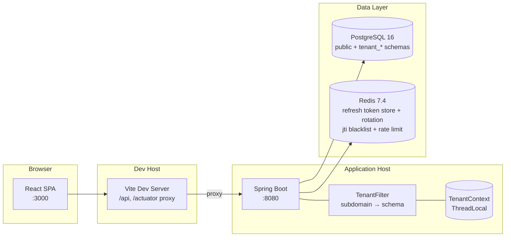
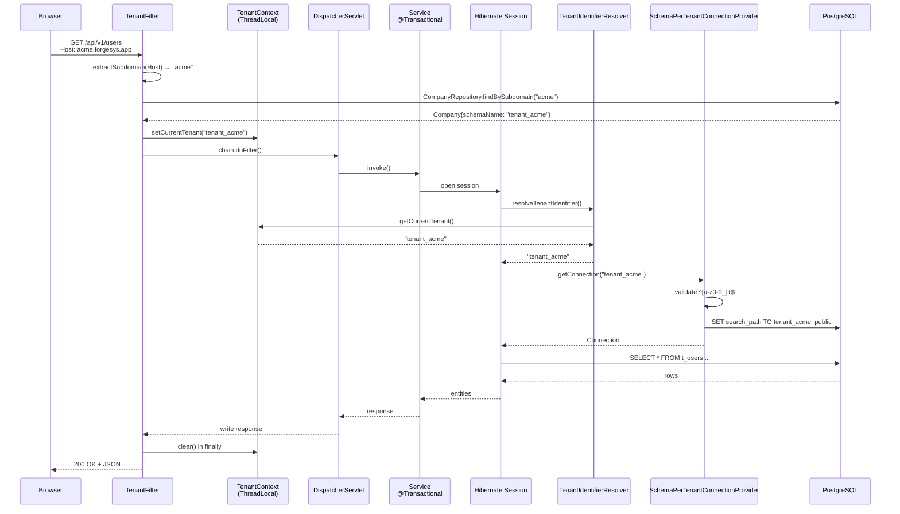
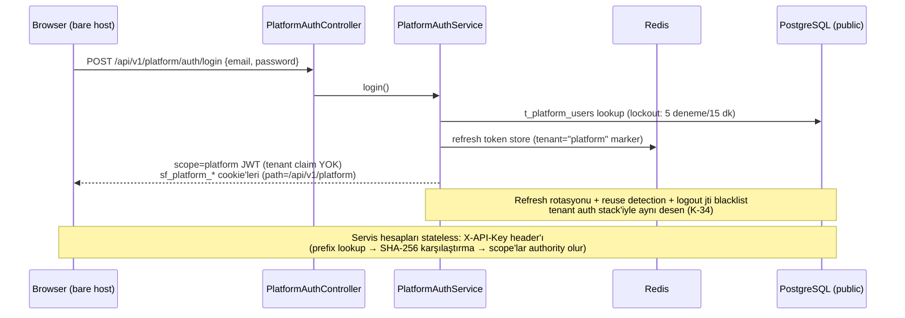
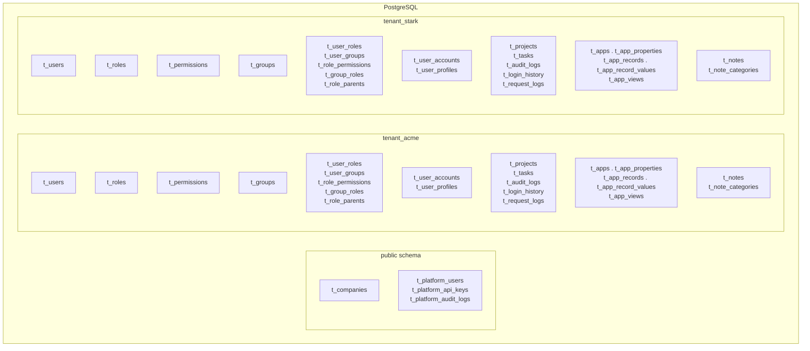
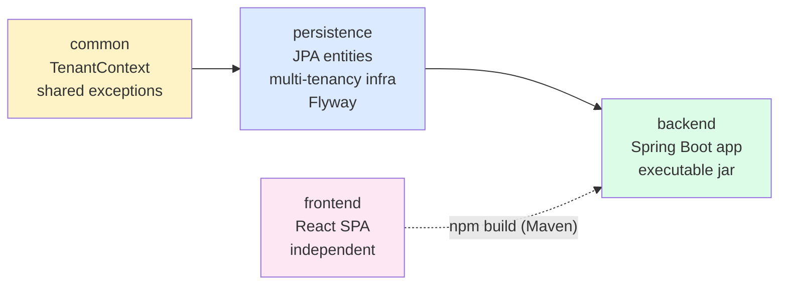
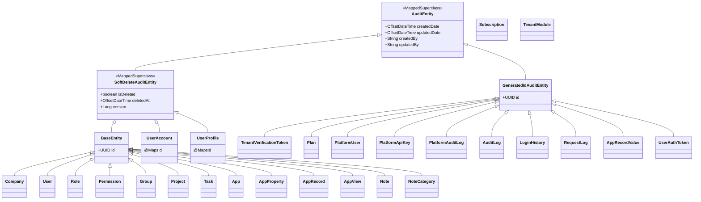

# Mimari

ForgeSys — modüler çok-kiracılı (multi-tenant) SaaS platformu. Schema-per-tenant izolasyonu, UUID PK, soft-delete + optimistic locking, Spring Data auditing. Hibrit ürün modeli: built-in modüller (pm: Projects & Tasks, apps: App Builder, notes — üçü aktif; Warehouse/Logistics planlı) + tenant custom app'leri (Notion-style App Builder, `apps` modülü). Bu doküman **mevcut sistemi** belgeler: auth (K-34), RBAC (K-26), audit/login/request log (K-19/K-27), plan/modül sistemi (K-16), app builder (K-15/K-42), metrics expose (K-43) ve platform süperadmin + servis hesapları (K-50) uygulanmış durumdadır; kalan işler [`ROADMAP.md`](ROADMAP.md)'de.

## Sistem Bileşenleri



**Dev:** Browser → Vite (`:3000`) → backend (`:8080`). **Prod:** Nginx gateway planlandı (K-33 — erteli), şu an Docker compose içinde tek app container. CI (GitHub Actions) develop/main push'unda GHCR imajı basar (`:latest`/`:edge`); sunucuya deploy manuel. Prod'da management endpoint'leri ayrı portta (8081, internal-only — [K-43](DECISIONS.md#k-43)).

## HTTP Request Yaşam Döngüsü

Tenant bağlamlı bir isteğin (`/api/v1/...`) sistemden geçiş akışı. `/api/v1/auth/**`, `/api/v1/platform/**` ve `/actuator/**` yolları `TenantFilter.shouldNotFilter()` ile muaf tutulur — tenant bağlamı kurmaz (platform API tenant-agnostiktir; `/api/v1/auth/platform-switch` ise hedef tenant'ın subdomain host'unda koştuğu için bilinçli olarak NORMAL tenant akışında kalır, K-50).



**Kritik noktalar:**

- `TenantContext` bir `ThreadLocal<String>` — request thread boyunca yaşar, `finally` bloğunda **mutlaka** clear edilmeli (thread pool reuse nedeniyle).
- `SchemaPerTenantConnectionProvider.getConnection` her connection alımında `SET search_path TO <tenant>, public` çalıştırır; `releaseConnection`'da reset eder.
- Schema adı regex `^[a-z0-9_]+$` ile doğrulanır — SQL injection savunması.
- `@Async` thread'lerde `TenantContext` otomatik taşınmaz — `TaskDecorator` gerekir ([RISK-10](DECISIONS.md#risk-10)).
- Tenant context null ise resolver `"public"` döner → public şema verisine (Company) erişilir.

### Platform Auth Akışı (K-50)

Platform kimlikleri (süperadmin + servis hesapları) `public` şemasında global yaşar — tenant kullanıcıları tenant şemasında kuralı değişmez. Ayrı bir auth yüzeyi: `/api/v1/platform/auth/*` + `/api/v1/platform/me`.



**Kritik noktalar:**

- Platform JWT'sinde `scope=platform` claim'i vardır ve `tenant` claim'i YOK — `JwtAuthenticationFilter` bu dalda `PlatformUserRepository.findTokenInvalidBefore` kullanır (tenant `t_users` tablosu `public` şemasında yoktur).
- Cookie'ler: `sf_platform_access_token` / `sf_platform_refresh_token` (httpOnly, path `/api/v1/platform`) — tenant cookie'lerinden ayrı; her iki cookie mevcutsa platform cookie'si kazanır.
- Her platform endpoint'i `authentication.principal.scope == 'platform'` şartıyla gated'dir — `platform:*` yetkisi taşıyan tenant JWT'si bile 403 alır (RISK-18 kapanışı).
- Platform bootstrap: `PlatformAdminBootstrapRunner` (`forgesys.bootstrap.platform-admin.*`, idempotent, default kapalı — dev profilinde açıktır).

### Tenant Switch / Impersonation Akışı (K-50)

Cross-tenant tenant-içi erişim **token exchange** ile — API mirroring YOK. Süperadmin, hedef tenant'ın en eski admin-capable kullanıcısı kimliğine bürünür.

```mermaid
sequenceDiagram
    participant P as Platform süperadmin<br/>(bare host)
    participant SC as PlatformSwitchController
    participant R as Redis
    participant T as Tenant frontend<br/>({sub}.host)
    participant AE as /auth/platform-switch

    P->>SC: POST /api/v1/platform/companies/{id}/switch {reason}
    SC->>R: switch:code:<sha256> (tek kullanım, 30 sn TTL)<br/>switch:active:<actorId> guard (SET NX)
    SC-->>P: {switchCode, targetUrl}
    P->>T: targetUrl?switchCode=... (yeni sekme)
    T->>AE: POST /api/v1/auth/platform-switch {code}
    AE->>R: Lua GETDEL (atomic claim) + guard=jti
    AE-->>T: Impersonation JWT (TTL ~30 dk, refresh YOK)<br/>claims: sub=hedef admin, tenant=hedef şema,<br/>act=platform aktör, imp=true
    Note over T,AE: RISK-19 tenant==context kontrolü değişmeden geçerli.<br/>AuditorAware act claim'ini tercih eder; çıkış = mevcut logout<br/>(jti blacklist + guard temizliği). Aktif tenant başına 1 impersonation.
```

**Kritik noktalar:**

- Switch kodu tek kullanımlıktır; schema uyuşmazlığı (kod hedef şeması ≠ Host'tan çözülen tenant) durumunda bile yakılır → 401.
- Tenant tarafında `/users/me` impersonation bilgisini döner (`act` aktör) → frontend `ImpersonationBanner` gösterir.
- Servis hesapları da `platform:tenant:access` scope'uyla aynı akışı programatik kullanabilir (token body'de de döner).

## Schema-per-Tenant Modeli

Tek PostgreSQL cluster, tek connection pool. Her tenant fiziksel olarak ayrı bir şemada (`tenant_<subdomain>`). Hibrid yaklaşım: schema isolation (data separation) + shared connection pool (operational simplicity).



**Neden SCHEMA stratejisi (DISCRIMINATOR veya DATABASE değil)?**

- **SCHEMA:** Strong isolation + moderate cost. Backup/restore tenant bazında mümkün. `SET search_path` ile runtime switching — tek connection pool yeterli.
- **DISCRIMINATOR_COLUMN:** En düşük maliyet ama en zayıf isolation — tek `WHERE tenant_id = ?`'in unutulması tüm kiracıların verisini sızdırır. Bu platform için kabul edilemez.
- **DATABASE:** En güçlü isolation ama operational maliyet yüksek — per-tenant connection pool, migration koordinasyonu, backup zinciri.

### Şema → Tablo Mapping

| Şema             | Tablo               | Amaç                                 | Migration           |
|------------------|---------------------|--------------------------------------|---------------------|
| `public`         | `t_companies`       | Tenant kayıt (subdomain→schema map, status)  | `public/V1__baseline.sql` |
| `public`         | `t_tenant_verification_tokens` | K-21 signup token'ları (SHA-256 digest; `admin_password_hash` provisioning sonrası null — RISK-30) | `public/V1__baseline.sql` (RISK-30 baked in) |
| `public`         | `t_plans`           | Plan kataloğu (FREE/PRO/ENTERPRISE; `PlanSyncRunner` upsert — registry kodda, [K-16](DECISIONS.md#k-16)) | `public/V2__plans_subscriptions_modules.sql` |
| `public`         | `t_subscriptions`   | Tenant→plan aboneliği (FREE default) | `public/V2__plans_subscriptions_modules.sql` |
| `public`         | `t_tenant_modules`  | Tenant modül aktivasyon kayıtları   | `public/V2__plans_subscriptions_modules.sql` |
| `public`         | `t_platform_users`  | Platform kimlikleri (K-50): HUMAN süperadmin + SERVICE hesaplar (sentetik e-mail, `enabled`/lockout/`token_invalid_before`) | `public/V3__platform_identity.sql` |
| `public`         | `t_platform_api_keys` | Servis hesabı API key'leri (K-50: prefix + SHA-256 hash; raw key yalnız oluşturmada bir kez gösterilir) | `public/V3__platform_identity.sql` |
| `public`         | `t_platform_audit_logs` | Platform audit trail (K-50: append-only trigger; actor/action/target) | `public/V3__platform_identity.sql` |
| `tenant_<sub>`   | `t_users`           | Kullanıcı hesabı (credential'lar)    | `tenant/V1__baseline.sql` |
| `tenant_<sub>`   | `t_auth_tokens`     | Kullanıcı lifecycle token'ları (email verify / password reset — SHA-256 digest, single-use; [K-48](DECISIONS.md#k-48)) | `tenant/V4__user_auth_tokens.sql` |
| `tenant_<sub>`   | `t_user_accounts`   | Security state (lock, failed login)  | `tenant/V1__baseline.sql` |
| `tenant_<sub>`   | `t_user_profiles`   | PII (isim, telefon, adres)           | `tenant/V1__baseline.sql` |
| `tenant_<sub>`   | `t_roles`           | RBAC rolleri (+ `all_permissions` flag, parent inheritance) | `tenant/V1__baseline.sql` |
| `tenant_<sub>`   | `t_permissions`     | RBAC yetkileri                       | `tenant/V1__baseline.sql` |
| `tenant_<sub>`   | `t_groups`          | Kullanıcı grupları                   | `tenant/V1__baseline.sql` |
| `tenant_<sub>`   | `t_user_roles`      | User↔Role join                       | `tenant/V1__baseline.sql` |
| `tenant_<sub>`   | `t_user_groups`     | User↔Group join                      | `tenant/V1__baseline.sql` |
| `tenant_<sub>`   | `t_role_permissions`| Role↔Permission join                 | `tenant/V1__baseline.sql` |
| `tenant_<sub>`   | `t_group_roles`     | Group↔Role join                      | `tenant/V1__baseline.sql` |
| `tenant_<sub>`   | `t_role_parents`    | Role→parent-role inheritance join    | `tenant/V1__baseline.sql` |
| `tenant_<sub>`   | `t_projects`        | Tipli proje konteyneri (K-45: `project_type TASKS/NOTES/APPS` + `parent_project_id` + tip-bazlı default; isim benzersizliği tip bazlı) | `tenant/V1__baseline.sql` + `tenant/V3__project_container.sql` |
| `tenant_<sub>`   | `t_tasks`           | Task içeriği (project-scoped)        | `tenant/V1__baseline.sql` |
| `tenant_<sub>`   | `t_audit_logs`      | Audit trail (append-only, K-19)      | `tenant/V1__baseline.sql` |
| `tenant_<sub>`   | `t_login_history`   | Login denemeleri (append-only, K-19) | `tenant/V1__baseline.sql` |
| `tenant_<sub>`   | `t_request_logs`    | Request/trace log + high-risk maskeli body (K-19 katman 3 + K-27) | `tenant/V2__request_logs.sql` |
| `tenant_<sub>`   | `t_apps` + 4        | App builder ailesi: `t_apps`(`project_id` — APPS koleksiyon konteynerine çapalı, K-45) + `t_app_properties(config jsonb)`, `t_app_records`, `t_app_record_values(value jsonb, GIN)`, `t_app_views(config jsonb)` — `apps` modülü aktivasyonda düşer | `module/apps/V1__app_builder.sql` + `module/apps/V2__apps_project_scoping.sql` (per-module history `flyway_schema_history_mod_apps`, [K-15](DECISIONS.md#k-15)) |
| `tenant_<sub>`   | `t_notes`, `t_note_categories` | Notes modülü (markdown; ikisi de `project_id` ile NOTES konteynerine çapalı — K-45; kategori FK `ON DELETE SET NULL`) — `notes` modülü aktivasyonda düşer | `module/notes/V1__notes.sql` + `module/notes/V2__notes_project_scoping.sql` (per-module history `flyway_schema_history_mod_notes`, [K-44](DECISIONS.md#k-44)) |

> Refresh token'lar tabloda DEĞİL — Redis-first (K-34, [DECISIONS](DECISIONS.md#k-34)); eski `t_refresh_tokens` ölü tablosu K-36 temizliğinde kaldırıldı. Migration geçmişi K-36 squash'ı + 2026-08-27 consolidation ile location başına tek `V1__baseline.sql`'e indirildi (public `V4`→`V3` yeniden numaralandı) — yeni public migration `V4`'ten, tenant migration `V5`'ten devam eder.

**Tenant provisioning akışı** (`TenantProvisioningService`, K-21 iki-fazlı):

**Faz 1 — `createPendingCompany`** (`@Transactional`, hafif):
1. `validateUnique` (subdomain + schemaName; `email_domain` K-32 ile kaldırıldı).
2. `public.t_companies` satırı INSERT (status=`PROVISIONING`).
3. `public.t_tenant_verification_tokens` INSERT (token SHA-256 digest — RISK-30 hash-at-rest; admin email/password-hash/first/last name + expiresAt).
4. `MailSender.send(MailMessage)` ([K-48](DECISIONS.md#k-48)) — TENANT_VERIFY şablonu, link: `${appBaseUrl}/verify-tenant?token=...`.

**Faz 2 — `verifyAndProvision(token)`** (`@Transactional`, senkron ağır — kullanıcı linki tıklar):
1. Token valid mi? (`usedAt != null` → `TENANT_TOKEN_ALREADY_USED`, `expiresAt <= now` → `TENANT_TOKEN_EXPIRED`, yok → `TENANT_TOKEN_INVALID`). Company `PROVISIONING` değilse reject.
2. `CREATE SCHEMA IF NOT EXISTS tenant_<subdomain>` (raw JDBC — PostgreSQL implicit commit, transaction dışına kaçar; DEBT-10 partial).
3. Flyway programmatik: `db/migration/tenant/*.sql` yeni şemada migrate.
4. `TenantContext.setCurrentTenant("tenant_<subdomain>")` set et.
5. Admin user INSERT (email/password-hash token'dan, `emailVerified=true`) + `RbacSeeder.seedForCurrentTenant()` (Admin rolü + permission catalog); token'ın `adminPasswordHash`'i null'lanır (RISK-30 — rollback'te null da döner, DEBT-10 recovery bozulmaz).
6. `TenantContext.clear()` `finally`'de.
7. `Company.status = ACTIVE`, `token.usedAt = now`.
8. Transaction commit'inden sonra (afterCommit senkronizasyonu) sample data seeding ([K-47](DECISIONS.md#k-47)): `TenantSampleDataService` config gate (`forgesys.provisioning.sample-data.enabled`) + iki katman fail-safe; seed'in REQUIRES_NEW tx'i aktivasyon/subscription satırlarını görmek zorunda olduğundan bilinçli post-commit.

**Platform admin bootstrap** (K-50): `PlatformAdminBootstrapRunner` (`forgesys.bootstrap.platform-admin.*`, idempotent-by-email) ilk HUMAN süperadmin'i `public.t_platform_users`'a oluşturur; self-signup YOK. Dev profilinde default credential'larla açıktır, prod'da env ile opt-in. (K-24'ün `system` tenant bootstrap'i K-50 ile kaldırıldı.)

> **DEBT-10 (kısmen çözüldü):** `createPendingCompany` tam transactional (yalnız DB write). `verifyAndProvision` `@Transactional` işaretli ama `CREATE SCHEMA` implicit commit → DDL transaction dışına kaçar. Recovery idempotency ile (`IF NOT EXISTS`, `usedAt` guard). Tam transactional DDL PostgreSQL'de mümkün değil.

## Modül Bağımlılık Grafiği



- **`common`** — Spring/JPA YOK. Yalnız `TenantContext` + paylaşılan exception'lar.
- **`persistence`** — JPA entity'ler, repository'ler, Hibernate multi-tenancy altyapısı, Flyway migration. `common`'a bağımlı.
- **`backend`** — Spring Boot uygulaması (controller/service/security/config). `common` + `persistence`'a bağımlı. **Tek executable jar üretir.**
- **`frontend`** — React SPA. Maven build backend jar'ına static gömülür; bağımsız npm script ile de çalışır.

Döngüsel bağımlılık YASAK. Kök pom yalnız aggregator + version management (lightweight parent); modüllere bağımlılık dayatmaz.

## Entity Hiyerarşisi



- **`@MappedSuperclass`** — DB tablosu karşılığı yok, sadece alanları concrete entity'lere inherits.
- `@SQLRestriction("is_deleted = false")` `SoftDeleteAuditEntity`'de → tüm subclass'larda soft-deleted satırlar otomatik filtrelenir.
- `@SQLDelete` her concrete entity'de ayrı (table-specific `UPDATE ... SET is_deleted = true, version = version + 1`).
- `UserAccount`/`UserProfile` `@MapsId` ile `User`'a shared PK (gereksiz FK yok).
- Tüm ID'ler UUID (`GenerationType.UUID`). Tablo adları `t_` prefix'li. Constraint'ler `idx_*`, `uk_*`, `fk_*`.
- `Subscription`/`TenantModule` (public şema) `BaseEntity`. Read model'ler hiyerarşi dışındadır ve K-49 ile entity değil kod içi Criteria DTO projection'dır (`web/projection/ProjectionListQuery` — eski `@Immutable @Subselect` `UserDirectoryView` kaldırıldı; view entity yalnızca karmaşık/yoğun tablolar için istisna). `AppRecordValue` ve `RequestLog` soft-delete'siz (`GeneratedIdAuditEntity`) — value clear = satır silinir (K-15); request log append-only (K-27). `PlatformUser`/`PlatformApiKey`/`PlatformAuditLog` (public şema, K-50) da `GeneratedIdAuditEntity` — platform audit append-only.
- **Tipli proje konteyneri (K-45):** `Project` = typed container (`project_type` NOT NULL: TASKS/NOTES/APPS; katalog aktif modüllerden türer). İçerik çapaları düz UUID kolonlarıdır (`@ManyToOne` yok — Task konvansiyonu): `Task.projectId`, `Note.projectId` + `NoteCategory.projectId` (NOTES), `App.projectId` (APPS koleksiyonu). İlişkisel veri katmanı (t_links) bilinçli erteli — talep-kapılı.

> Detaylar: [`persistence/AGENTS.md`](../persistence/AGENTS.md)

## Konfigürasyon Profilleri

Profile-based config. Aktif profil `SPRING_PROFILES_ACTIVE` (default: `dev`).

| Profil | Veritabanı            | Kullanım                       | `.env` gerekli mi |
|--------|-----------------------|--------------------------------|-------------------|
| `dev`  | PostgreSQL `:5432`    | IDE debug (default'lar gömülü) | Hayır             |
| `prod` | PostgreSQL (`.env`)   | `docker-compose-prod.yml`      | **Evet**          |
| `test` | H2 in-memory          | `@SpringBootTest`              | Hayır             |

- `ddl-auto=none` ZORUNLU (ASLA `validate` — schema-per-tenant + lazy tenant şeması startup'ta çöker). Şema tamamen Flyway'de.
- **Test profili istisnası:** `ddl-auto=create-drop` + `flyway.enabled=false`. Spring Boot 4.1 + Flyway 12'de `FlywayAutoConfiguration` H2 dialect algılamıyor (`flyway-database-h2` BOM'da yok), Flyway bean oluşturulmuyor. Test'ler Hibernate'in entity metadata'dan şema üretmesine güveniyor. Gerçek Flyway test'i [`ROADMAP.md`](ROADMAP.md) Testcontainers kapsamında (Faz 3.X).
- H2 `MODE=PostgreSQL`'de çalışır → build Docker gerektirmez.
- H2 sınırları: `JSONB`, partial index, `SET search_path` desteklenmez → multi-tenancy akışı H2'de test edilemez, sadece context yükü doğrulanır.
- **Mail/SMTP ([K-48](DECISIONS.md#k-48)):** sender profil ile split — prod `SmtpMailSender` (`spring.mail.*` → `MAIL_HOST`/`MAIL_PORT`/`MAIL_USERNAME`/`MAIL_PASSWORD`; `MAIL_HOST` boşsa startup fail-fast), dev `LogMailSender` (log'a düşer), test `InMemoryMailSender`. Ortak config `forgesys.mail.*`: `from`, `default-language` (tr default), `templates-dir` (classpath `mail/*.html` override — `infra/templates/`). Şablonlar TR/EN: tenant-verify, email-verify, password-reset.
- **Platform kimlikleri ([K-50](DECISIONS.md#k-50)):** `forgesys.platform.auth.*` (`refresh-ttl-days` 7, `impersonation-ttl-minutes` 30, `cookie-path` `/api/v1/platform`, `cookie-secure` prod'da `true`, `cookie-same-site` Lax; access TTL `jwt.access-token-ttl-minutes` ile ortak). Bootstrap: `forgesys.bootstrap.platform-admin.*` (`enabled`/`email`/`password`/`display-name`; env `FORGESYS_BOOTSTRAP_PLATFORM_ADMIN_*` — dev default `platform-admin@forgesys.dev`, prod opt-in).
- **Actuator/metrics ([K-43](DECISIONS.md#k-43)):** dev/test — same-port, `health,info,metrics,prometheus` (scrape auth'suz). Prod — ayrı management portu **8081** (compose'da `expose`-only, host'a publish edilmez; management child context'inde security zinciri uygulanmaz → internal ağdan auth'suz scrape) + daraltılmış exposure (`health,info,prometheus`). Custom gauge: `forgesys.tenants.active`.

## İlgili Dokümanlar

- [`AGENTS.md`](../AGENTS.md) — AI asistan kuralları + genel proje prensipleri
- [`README.md`](../README.md) — Kurulum, çalıştırma, API
- [`ROADMAP.md`](ROADMAP.md) — Faz/epik yol haritası (ticket numarasız)
- [`DECISIONS.md`](DECISIONS.md) — Karar kayıtları (K-XX/RISK-XX/DEBT-XX)
- [`backend/AGENTS.md`](../backend/AGENTS.md) — Backend modülü kuralları + gotcha'lar
- [`persistence/AGENTS.md`](../persistence/AGENTS.md) — Persistence modülü, entity hiyerarşisi, Flyway
- [`common/AGENTS.md`](../common/AGENTS.md) — Common çekirdek (TenantContext)
- [`frontend/AGENTS.md`](../frontend/AGENTS.md) — Frontend stack & yapı
