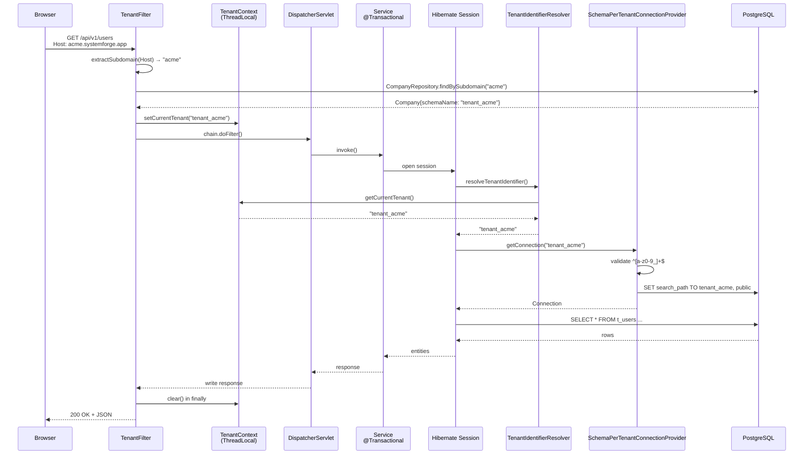
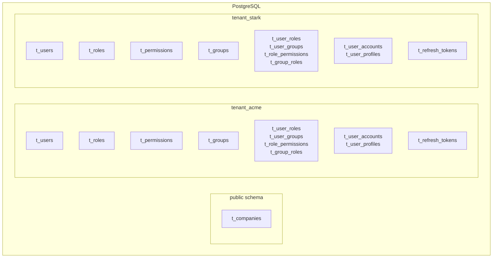
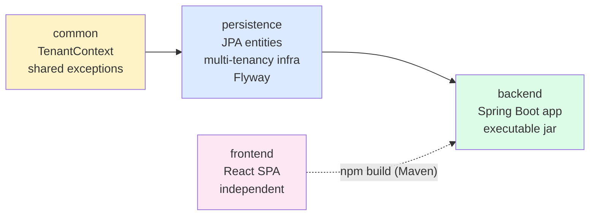
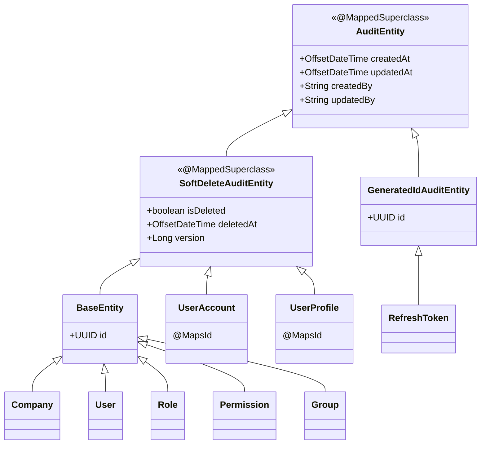

# Mimari

SystemForge — modüler çok-kiracılı (multi-tenant) SaaS platformu. Schema-per-tenant izolasyonu, UUID PK, soft-delete + optimistic locking, Spring Data auditing. Hibrit ürün modeli: built-in modüller (Tasks/Notes/Warehouse/Logistics) + tenant custom app'leri (Notion-style App Builder). Bu doküman **mevcut Faz 1 altyapısını** belgeler; auth/RBAC/modüller `BACKLOG.md`'de planlanmıştır.

## Sistem Bileşenleri

```mermaid
flowchart LR
    subgraph Browser
        UI[React SPA<br/>:3000]
    end
    subgraph DevHost[Dev Host]
        Vite[Vite Dev Server<br/>/api, /actuator proxy]
    end
    subgraph AppHost[Application Host]
        SB[Spring Boot<br/>:8080]
        TF[TenantFilter<br/>subdomain → schema]
        CTX[(TenantContext<br/>ThreadLocal)]
        SB --- TF
        TF --- CTX
    end
    subgraph DataHost[Data Layer]
        PG[(PostgreSQL 16<br/>public + tenant_* schemas)]
        Redis[(Redis 7.4<br/>cache + token blacklist<br/>Faz 2.6)]
    end

    UI --> Vite
    Vite -- proxy --> SB
    SB --> PG
    SB -. Faz 2.6 .-> Redis
```

**Dev:** Browser → Vite (`:3000`) → backend (`:8080`). **Prod:** Nginx gateway planlandı (Faz 1.5 — erteli), şu an Docker compose içinde tek app container.

## HTTP Request Yaşam Döngüsü

Tenant bağlamlı bir isteğin (`/api/v1/...`) sistemden geçiş akışı. `/api/v1/auth/**` ve `/actuator/**` yolları `TenantFilter.shouldNotFilter()` ile muaf tutulur — tenant bağlamı kurmaz.



**Kritik noktalar:**

- `TenantContext` bir `ThreadLocal<String>` — request thread boyunca yaşar, `finally` bloğunda **mutlaka** clear edilmeli (thread pool reuse nedeniyle).
- `SchemaPerTenantConnectionProvider.getConnection` her connection alımında `SET search_path TO <tenant>, public` çalıştırır; `releaseConnection`'da reset eder.
- Schema adı regex `^[a-z0-9_]+$` ile doğrulanır — SQL injection savunması.
- `@Async` thread'lerde `TenantContext` otomatik taşınmaz — `TaskDecorator` gerekir (`BACKLOG.md` SF-181).
- Tenant context null ise resolver `"public"` döner → public şema verisine (Company) erişilir.

## Schema-per-Tenant Modeli

Tek PostgreSQL cluster, tek connection pool. Her tenant fiziksel olarak ayrı bir şemada (`tenant_<subdomain>`). Hibrid yaklaşım: schema isolation (data separation) + shared connection pool (operational simplicity).



**Neden SCHEMA stratejisi (DISCRIMINATOR veya DATABASE değil)?**

- **SCHEMA:** Strong isolation + moderate cost. Backup/restore tenant bazında mümkün. `SET search_path` ile runtime switching — tek connection pool yeterli.
- **DISCRIMINATOR_COLUMN:** En düşük maliyet ama en zayıf isolation — tek `WHERE tenant_id = ?`'in unutulması tüm kiracıların verisini sızdırır. Bu platform için kabul edilemez.
- **DATABASE:** En güçlü isolation ama operational maliyet yüksek — per-tenant connection pool, migration koordinasyonu, backup zinciri.

### Şema → Tablo Mapping

| Şema             | Tablo               | Amaç                                 | Migration           |
|------------------|---------------------|--------------------------------------|---------------------|
| `public`         | `t_companies`       | Tenant kayıt (subdomain→schema map)  | `public/V1__...sql` |
| `tenant_<sub>`   | `t_users`           | Kullanıcı hesabı (credential'lar)    | `tenant/V1__...sql` |
| `tenant_<sub>`   | `t_user_accounts`   | Security state (lock, failed login)  | `tenant/V1__...sql` |
| `tenant_<sub>`   | `t_user_profiles`   | PII (isim, telefon, adres)           | `tenant/V1__...sql` |
| `tenant_<sub>`   | `t_roles`           | RBAC rolleri                         | `tenant/V1__...sql` |
| `tenant_<sub>`   | `t_permissions`     | RBAC yetkileri                       | `tenant/V1__...sql` |
| `tenant_<sub>`   | `t_groups`          | Kullanıcı grupları                   | `tenant/V1__...sql` |
| `tenant_<sub>`   | `t_user_roles`      | User↔Role join                       | `tenant/V1__...sql` |
| `tenant_<sub>`   | `t_user_groups`     | User↔Group join                      | `tenant/V1__...sql` |
| `tenant_<sub>`   | `t_role_permissions`| Role↔Permission join                 | `tenant/V1__...sql` |
| `tenant_<sub>`   | `t_group_roles`     | Group↔Role join                      | `tenant/V1__...sql` |
| `tenant_<sub>`   | `t_refresh_tokens`  | JWT refresh token'ları               | `tenant/V1__...sql` |

**Tenant provisioning akışı** (`TenantProvisioningService.provisionTenant`):

1. `public.t_companies` satırı INSERT (subdomain, emailDomain, schemaName, status=ACTIVE).
2. `CREATE SCHEMA tenant_<subdomain>` (raw JDBC, transaction dışı — DDL implicit commit).
3. Flyway programmatik: `public/db/migration/tenant/*.sql` yeni şemada migrate.
4. `TenantContext.setCurrentTenant("tenant_<subdomain>")` set et.
5. Admin user INSERT (JPA, transactional).
6. `TenantContext.clear()` `finally`'de.

> **Not:** `provisionTenant` + `createAdminUser` `@Transactional` değil (`BACKLOG.md` SF-001/002). Faz 2.0 refactoring kapsamında düzeltilecek.

## Modül Bağımlılık Grafiği



- **`common`** — Spring/JPA YOK. Yalnız `TenantContext` + paylaşılan exception'lar.
- **`persistence`** — JPA entity'ler, repository'ler, Hibernate multi-tenancy altyapısı, Flyway migration. `common`'a bağımlı.
- **`backend`** — Spring Boot uygulaması (controller/service/security/config). `common` + `persistence`'a bağımlı. **Tek executable jar üretir.**
- **`frontend`** — React SPA. Maven build backend jar'ına static gömülür; bağımsız npm script ile de çalışır.

Döngüsel bağımlılık YASAK. Kök pom yalnız aggregator + version management (lightweight parent); modüllere bağımlılık dayatmaz.

## Entity Hiyerarşisi



- **`@MappedSuperclass`** — DB tablosu karşılığı yok, sadece alanları concrete entity'lere inherits.
- `@SQLRestriction("is_deleted = false")` `SoftDeleteAuditEntity`'de → tüm subclass'larda soft-deleted satırlar otomatik filtrelenir.
- `@SQLDelete` her concrete entity'de ayrı (table-specific `UPDATE ... SET is_deleted = true, version = version + 1`).
- `UserAccount`/`UserProfile` `@MapsId` ile `User`'a shared PK (gereksiz FK yok).
- Tüm ID'ler UUID (`GenerationType.UUID`). Tablo adları `t_` prefix'li. Constraint'ler `idx_*`, `uk_*`, `fk_*`.

> Detaylar: [`persistence/AGENTS.md`](../persistence/AGENTS.md)

## Konfigürasyon Profilleri

Profile-based config. Aktif profil `SPRING_PROFILES_ACTIVE` (default: `dev`).

| Profil | Veritabanı            | Kullanım                       | `.env` gerekli mi |
|--------|-----------------------|--------------------------------|-------------------|
| `dev`  | PostgreSQL `:5432`    | IDE debug (default'lar gömülü) | Hayır             |
| `prod` | PostgreSQL (`.env`)   | `docker-compose-prod.yml`      | **Evet**          |
| `test` | H2 in-memory          | `@SpringBootTest`              | Hayır             |

- `ddl-auto=none` ZORUNLU (ASLA `validate` — schema-per-tenant + lazy tenant şeması startup'ta çöker). Şema tamamen Flyway'de.
- **Test profili istisnası:** `ddl-auto=create-drop` + `flyway.enabled=false`. Spring Boot 4.1 + Flyay 12'de `FlywayAutoConfiguration` H2 dialect algılamıyor (`flyway-database-h2` BOM'da yok), Flyay bean oluşturulmuyor. Test'ler Hibernate'in entity metadata'dan şema üretmesine güveniyor. Gerçek Flyay test'i `BACKLOG.md` SF-270 (Testcontainers) kapsamında.
- H2 `MODE=PostgreSQL`'de çalışır → build Docker gerektirmez.
- H2 sınırları: `JSONB`, partial index, `SET search_path` desteklenmez → multi-tenancy akışı H2'de test edilemez, sadece context yükü doğrulanır.

## İlgili Dokümanlar

- [`AGENTS.md`](../AGENTS.md) — AI asistan kuralları + genel proje prensipleri
- [`README.md`](../README.md) — Kurulum, çalıştırma, API
- [`BACKLOG.md`](../BACKLOG.md) — Yol haritası (Faz 1.5-6, SF-001...405) + karar kayıtları (K-XX, RISK-XX, DEBT-XX)
- [`backend/AGENTS.md`](../backend/AGENTS.md) — Backend modülü kuralları + gotcha'lar
- [`persistence/AGENTS.md`](../persistence/AGENTS.md) — Persistence modülü, entity hiyerarşisi, Flyway
- [`common/AGENTS.md`](../common/AGENTS.md) — Common çekirdek (TenantContext)
- [`frontend/AGENTS.md`](../frontend/AGENTS.md) — Frontend stack & yapı
